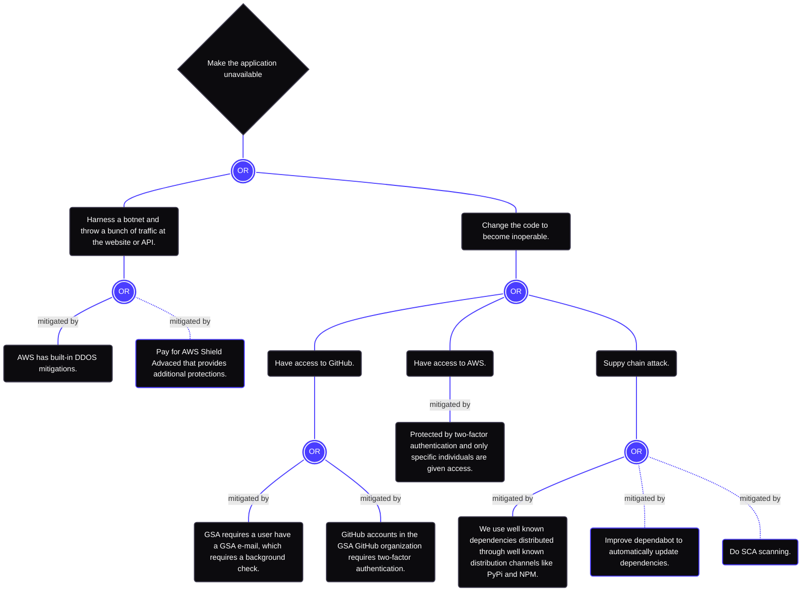
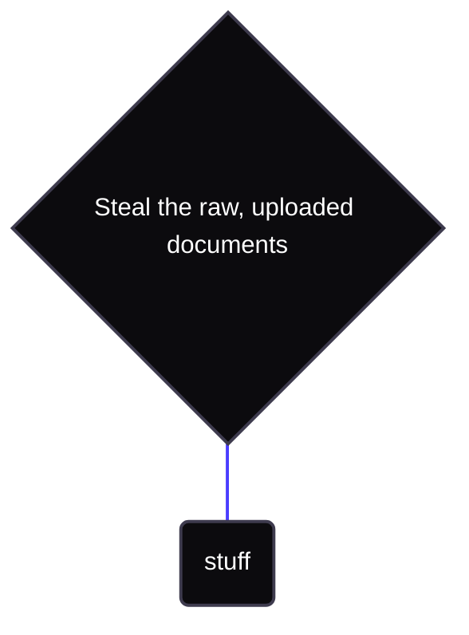
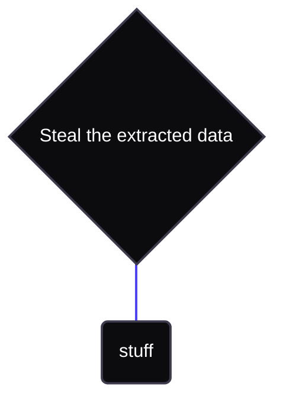
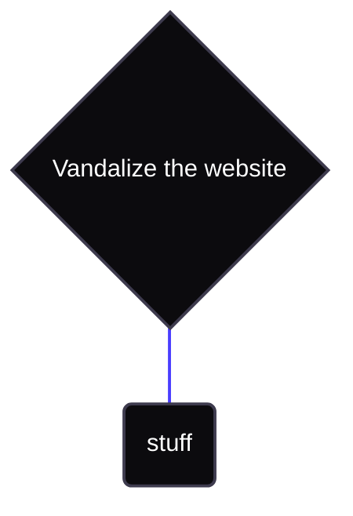

# Document Extractor

This document uses [`threatdown`](https://threatdown.xyz) to help create the final document.

Run `npx threatdown ./THREAT_MODEL.template.md --output ./THREAT_MODEL.md` to create it.  Don't forget to run this
command and commit the final document.

Do not edit `THREAT_MODEL.md` directly.

## Introduction

The threat model is intended to ensure that the application is developed with security built-in from the beginning and
in an ongoing way.  By documenting potential threats and assets, along with countermeasures and mitigation actions
explicitly, better and more informed decisions can be made for improved security.

This document is stored in revision control along with the application code so that it is highly visible and accessible
to the individuals doing development and deployment and can be modified in concert with the code.

## Entry Points

1. Website.  Users interact with our application through the website.  Anyone can interact with the website.
2. API.  Users can interact with the API through the website or directly.
3. AWS console.  AWS credentials can be used to log into the AWS console directly and access data, code, and
   configuration.
4. S3 bucket document bucket.  The S3 bucket stores the documents and is written to by the application.

## Assets

1. The code itself.
2. The website.
3. Documents uploaded to the application.
4. The extracted data from the documents.

## Threats

<!-- ```threatdown
__Make the application unavailable__
- Harness a botnet and throw a bunch of traffic at the website or API.
  - [x] AWS has built-in DDOS mitigations.
  - [ ] Pay for AWS Shield Advaced that provides additional protections.
- Change the code to become inoperable.
  - Have access to GitHub.
    - [x] GSA requires a user have a GSA e-mail, which requires a background check.
    - [x] GitHub accounts in the GSA GitHub organization requires two-factor authentication.
  - Have access to AWS.
    - [x] Protected by two-factor authentication and only specific individuals are given access.
  - Suppy chain attack.
    - [x] We use well known dependencies distributed through well known distribution channels like PyPi and NPM.
    - [ ] Improve dependabot to automatically update dependencies.
    - [ ] Do SCA scanning.
``` -->



<!-- ```threatdown
__Steal the raw, uploaded documents__
- stuff
``` -->



<!-- ```threatdown
__Steal the extracted data__
- stuff
``` -->



<!-- ```threatdown
__Vandalize the website__
- stuff
``` -->

